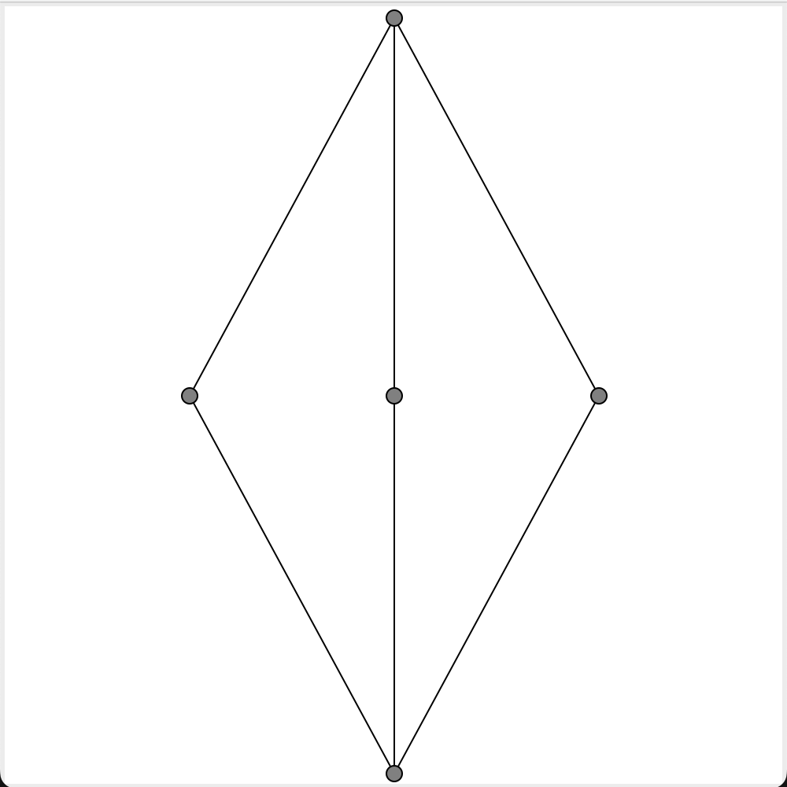

# pyLattice

pyLattice is a python library to menage Lattice and PoSet (Partially order set) in python.


## Structure
- PoSet object
    - Domination matrix
    - Object
    - Labels

- Construct a PoSet
    - main
    - from cover matrix
    - from function
    - operation beetwen PoSet

- Rappresentation
    - hasse: 
    

- Action on PoSet
    - join
    - meet
    - ...
    - Dedekind completetion

- Lattice object
    - Differences beetwen poset

- Construct a Lattice
    - main
    - Special Lattice
        - Chain
        - Powerset:
            `pl.Lattice.from_power_set(3).hasse(labels = True, shape = (400,300))`
            will return: 
        - "cw"
    - from function

- Congruences stuff!
    - Congruence structure
    - Calculate a Con(a,b)
    - Calculate join_irriducible Con
    - Calculate ConL
    - "dinamic con"

## PoSet
A PoSet object has just four different attributes:
- `domination_matrix`: a domination matrix, $Z$ is a squared matrix $n\times n$ where $n$ is the number of element in the PoSet. 
    $$Z_{ij} = 1 \Longleftrightarrow x_i \unlhd x_j\space 0 \space \text{otherwise} $$
- `cover_matrix`: a cover matrix, $M$,  is a squared matrix $n\times n$ where $n$ is the number of element in the PoSet. 
    $$M_{ij} = 1 \Longleftrightarrow x_i \prec x_j\space 0 \space \text{otherwise} $$
- `obj`: a list of the object in the PoSet
- `labels`: a list of labels to show in the rappresentation of the PoSet.

### Construct a poset
To construct a PoSet you just need a domination matrix:

```python
P = PoSet(domination_matrix)
```
If you don't specify object and labels they will just be progressive number from $0$ to $n-1$

To define a PoSet there are other ways:

- From a cover matrix:  
    Some times you need to construct a PoSet from just the cover matrix. For example if you hand-draw a PoSet it's fast to manually compute cover matrix then domination matrix.
    For this situation you can just use the `from_cover_matrix` function:
    `P = PoSet.from_cover_matrix(cover_matrix)`

- From a function:  
    You maybe want to create a PoSet from some object and a function to determinate if an element dominate an other. For this you can use `from_function` module:  
    `P = PoSet.from_function(list(range(1,20)), lambda a,b: a%b == 0)`
    You need to pass to elemnt:
    - `X`: Element to compare
    - `f`: function to compare. This function should be to the form: $f(a,b) = True \Leftrightarrow a\unlhd b\space False \space\text{otehrwise}$  

- From operation beetwen different PoSet (_see later_)

### Operation on a PoSet
With a PoSet you can compute all this operation (_see example file_)
- Chek a domination
- Chek a cover
- Calculate upset and down set of one or more element
- Max and min in a sub set of element
- Join and Meet:
    - If they are not unique and you have specify `force = True` it returns a list of all
    - If they are not unique and you haven't specify `force = True` or it's not define it return `None`
_

### Operation beetwen PoSet
With two or more PoSet you can compute this operation
- Cartesian product: 
    [...]
- sum