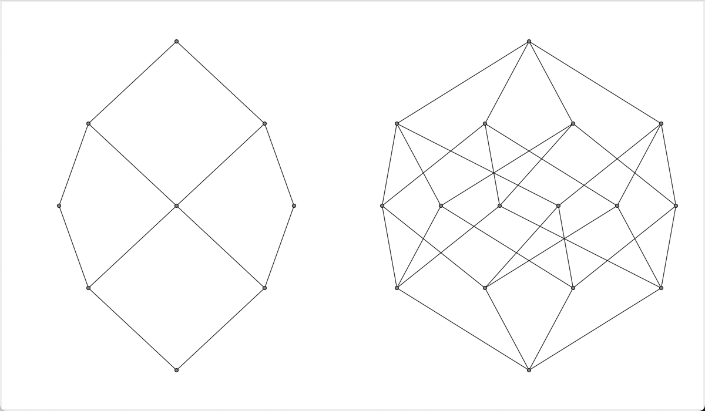
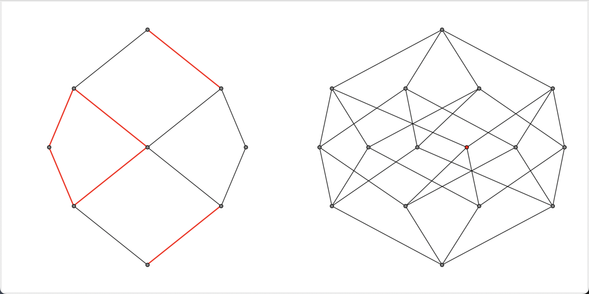

# pyLattice

pyLattice is a Python library designed to manage Lattices and Partially Ordered Sets (PoSets). It provides tools for creating, manipulating, and visualizing these algebraic structures.

## Table of Contents
- [Introduction](#introduction)
- [PoSet](#poset)
    - [Construction](#construction)
    - [Properties](#properties)
    - [Operations](#operations)
    - [Operations between PoSets](#operations-between-posets)
- [Lattice](#lattice)
    - [Construction](#construction-1)
    - [Functions](#functions)
    - [Congruences](#congruences)
- [Hasse Diagram (GUI)](#hasse-diagram-gui)
- [Dataset](#dataset)

## Introduction
pyLattice allows you to work with ordered sets and lattices, offering a range of functions from basic operations to complex congruence calculations and interactive visualizations.

## PoSet

### Construction
You can construct a `PoSet` in several ways:

**1. From a Domination Matrix**
The most direct way is using a domination matrix $Z$, where $Z_{ij} = 1 \iff x_i \unlhd x_j$ and $0$ otherwise.

```python
import pyLattice.pyLattice as pl

domination_matrix = [ [1, 0, 0], 
                      [1, 1, 0], 
                      [1, 0, 1] ]
P = pl.PoSet(domination_matrix, X=['a', 'b', 'c'])
```
If you don't specify objects (`X`) and labels, progressive numbers from $0$ to $n-1$ will be used.

**2. From a Cover Matrix**
Useful if you have the immediate covering relations.
```python
P = pl.PoSet.from_cover_matrix(cover_matrix)
```

**3. From a Function**
Define a relationship using a function that returns `True` if $a \unlhd b$.
```python
```python
# Multiples of numbers from 1 to 20
P = pl.PoSet.from_function(list(range(1, 20)), lambda a, b: a % b == 0)
```


### Properties
A `PoSet` object has several attributes. Some are intrinsic to the definition, while others are calculated for graphical representation (see `get_hasse_variables`):
- Intrinsic:
    - `domination_matrix`: The domination matrix.
    - `cover_matrix`: The cover matrix where $M_{ij} = 1 \iff x_i \prec x_j$.
    - `obj`: List of objects in the PoSet.
- Graphic (generated by `get_hasse_variables`):
    - `labels`: List of labels for representation.
    - `nodes`: Coordinates of the nodes.
    - `vertex`: List of edges.
    - `radius`: Radius of the nodes.
    - `font_size`: Font size for labels.
    - `vertex_color`: Color of the edges.
    - `nodes_color`: Color of the nodes.
    - `stroke_weights`: Weights of the edges.

### Operations
You can perform various operations on a `PoSet` instance `P`:

- **Check Order**: `P.domination(a, b)` returns `True` if $a \unlhd b$.
- **Check Cover**: `P.cover(a, b)` returns `True` if $a \prec b$.
- **Upset/Downset**: Calculate the set of elements dominating or dominated by a set of elements.
    ```python
    P.upset('a')
    P.downset('b', 'c')
    ```
- **Max/Min Subset**: Find maximal or minimal elements within a subset.
    ```python
    P.max_sub_set(subset_of_elements)
    ```
- **Join/Meet**: Calculate the join ($\vee$) or meet ($\wedge$) of elements.
    ```python
    P.join('a', 'b') # Returns the join if unique
    P.join('a', 'b', force=True) # Returns a list of all possible joins
    ```

### Operations between PoSets
You can combine PoSets using operators:

- **Sum (`+`)**: The union of two disjoint PoSets. $x \unlhd y$ if they preserve their original order.
    ```python
    H = P + Q
    ```
- **Cartesian Product (`*`)**: An ordered set where $(x_1, x_2) \unlhd (y_1, y_2) \iff x_1 \unlhd_1 y_1 \land x_2 \unlhd_2 y_2$.
    ```python
    H = P * Q
    ```

## Lattice
A Lattice is a PoSet where *join* and *meet* are **always** defined and unique for any pair of elements.

### Construction
In addition to PoSet methods, Lattices have specialized constructors:
- **Dedekind Completion**: Creates a lattice from a PoSet.
    ```python
    L = P.dedekind_completion()
    ```
    

- **From Power Set**: Lattice of subsets of a set with $n$ elements.
    ```python
    L = pl.Lattice.from_power_set(3)
    ```

- **From Chain**: A linear order of $n$ elements.
    ```python
    L = pl.Lattice.from_chain(4)
    ```

- **From Component-Wise Comparison (CW)**: Optimized construction for products of chains.
    ```python
    # Equivalent to chain(3) * chain(3) * chain(2)
    L = pl.Lattice.from_cw(3, 3, 2)
    ```

- **Conversion**: Convert a PoSet to a Lattice (checking validity first).
    ```python
    if P.is_lattice():
        L = P.as_lattice()
    ```

### Functions
Lattices support all PoSet operations plus specific ones:
- `join` and `meet` (guaranteed to return a single element).
- `join_irriducibili` / `meet_irriducibili`.

### Congruences
Congruences are a fundamental aspect of Lattice theory. A congruence is represented by a list `[c_0, c_1, ..., c_n]` where `c_i = c_j` means $x_i \equiv x_j$.

- **Calculate Congruence**: `L.calcola_congruenza(a, b)` finds the smallest congruence collapsing $a$ and $b$.
- **Irreducible Congruences**: `L.congruenze_join_irriducibili()`
- **All Congruences**: `L.all_congruenze()`
- **Congruence Lattice**: Generate the lattice of all congruences.
    ```python
    ConL = L.CongruenceLattice()
    ```
    

- **Dynamic View**: Explore congruences interactively.
    ```python
    L.dinamic_congruences()
    ```
    

- **Visualize a Congruence**:
    ```python
    L.show_congruence(congruence)
    ```
    

## Hasse Diagram (GUI)
You can visualize any PoSet or Lattice using Hasse diagrams.

To show a diagram:
```python
P.hasse()
```

### Plotting Multiple Diagrams
You can plot multiple diagrams in a single window:
```python
pl.PoSet.hasse(P, Q, H, grid=(1, 3))
```

### Parameters
The `hasse()` function accepts several customization parameters:
- `shape`: Tuple `(width, height)` for the window size (default `(500, 500)`).
- `grid`: Tuple `(rows, cols)` to arrange multiple plots.
- `title`: Window title.
- `show_labels`: Boolean to show/hide labels.
- `font_size`: Text size for labels.
- `radius`: Radius of the nodes.
- `init`: Boolean (default `True`). If `False`, it assumes graphic variables have already been calculated.

### Customization & The `init` Parameter
**Important**: By default, `PoSet` objects do not store graphic variables (`nodes`, `vertex`, etc.). 
- When you call `P.hasse()`, it runs `P.get_hasse_variables()` internally (since `init=True` by default).
- If you want to **customize** the diagram (e.g., color a specific node), you must follow this workflow:
    1. Call `P.get_hasse_variables()` explicitly to generate the attributes.
    2. Modify the attributes as needed (e.g., `P.nodes_color[3] = 'red'`).
    3. Call `P.hasse(init=False)`. If you leave `init=True`, your changes will be overwritten by the default calculation.

```python
# 1. Generate variables
P.get_hasse_variables(radius=5, font_size=12)

# 2. Apply custom changes
P.nodes_color[3] = 'red' 

# 3. Plot without re-initializing
P.hasse(init=False)
```

*Note: The best way to understand complex diagrams is to interact with them by dragging nodes with your mouse.*

## Dataset
Lattices can be used to model datasets modulo a partial order. The library includes classes like `DataSet` and `CWDataSet` to handle observations with associated frequency distributions, useful for statistical applications on posets.